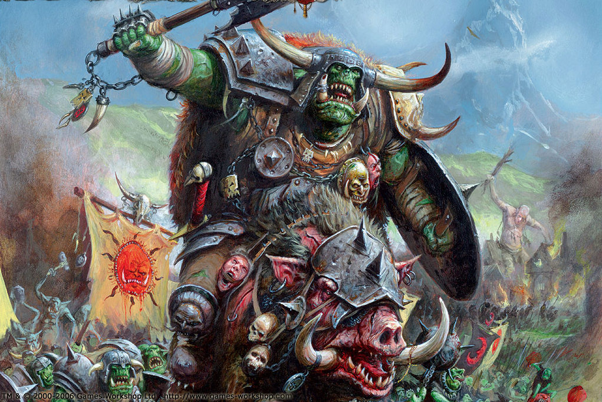

::: columns

::: {.column width="32%"}

:::

::: {.column width="2%"}

:::

::: {.column width="66%"}

Dans les Montagnes du Bord du Monde et les principautés frontalière, résonne le fracas d'une Waaaght! Ce n’est pas le tonnerre mais le rire rauque des Gobelins, le grognement sourd des Orques, et, par-dessus tout, le cri strident, affamé, des Squigs qui compose la tribu des **Zouvreurs Ki Brill’**.

:::

:::

Leur nom, gravé dans la peur des villages aux alentours, est synonyme de terreur et de destruction. Ce nom fait référence à leur armure d'une couleur jaune éclatante, ornée de crânes et de symboles tribaux, qui semble briller même dans les ténèbres les plus profondes. Car cette armée n’est pas seulement une meute d’Orques assoiffés de carnage, mais une alliance maudite, soudée par la magie noire et la ruse gobeline.

À leur tête, **Krak’O Cou**, un seigneur Orque Noir dont la carrure massive et la cicatrice en forme de croissant de lune sur le torse racontent mille batailles. Son rire rauque fait trembler les montagnes, et sa hache, forgée dans le métal des étoiles tombées, ne connaît ni pitié ni repos. Mais même un colosse comme Krak’O Cou sait qu’une horde ne vit pas que par la force brute. C’est pourquoi il a scellé un pacte avec **Rikiki**, le chamane gobelin de la nuit, dont les yeux jaunes luisent d’une intelligence venimeuse. Ses incantations tordent la réalité, ses potions transforment les faibles en monstres, et ses rires aigus précèdent toujours la chute des ennemis.

Autour d’eux gravite une cour de sous-chefs aussi redoutables que déments. **M’ek Ki Dens**, le chamane gobelin, manie une magie plus subtile que celle de Rikiki, mais tout aussi mortelle. Ses sorts s’insinuent dans les rêves des adversaires, les poussant à la folie avant même que la bataille ne commence. Et puis il y a **Big’Orno**, un gobelin de la nuit d’une taille inhabituelle, dont la cruauté n’a d’égale que son ambition. Armé d’une épée dentelée et d’un bouclier clouté en forme de lune grimacente, il mène les raids les plus audacieux, toujours le premier à reculer, toujours le dernier à charger.

::: {layout-ncol=6}

{group="armee1"}

{group="armee1"}

{group="armee1"}

{group="armee1"}

{group="armee1"}

{group="armee1"}

:::

Les Zouvreurs Ki Brill’ ne se contentent pas de piller les villages de la Péninsule Noire. Ils ouvrent les portes des royaumes souterrains, libèrent des horreurs oubliées, et laissent derrière eux des terres maudites où plus rien ne pousse.

