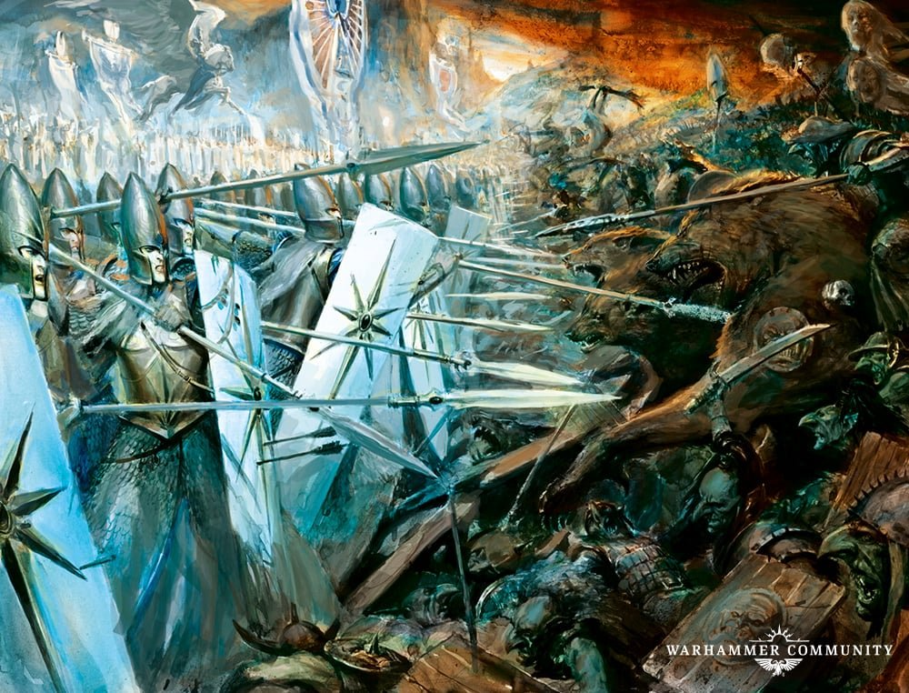
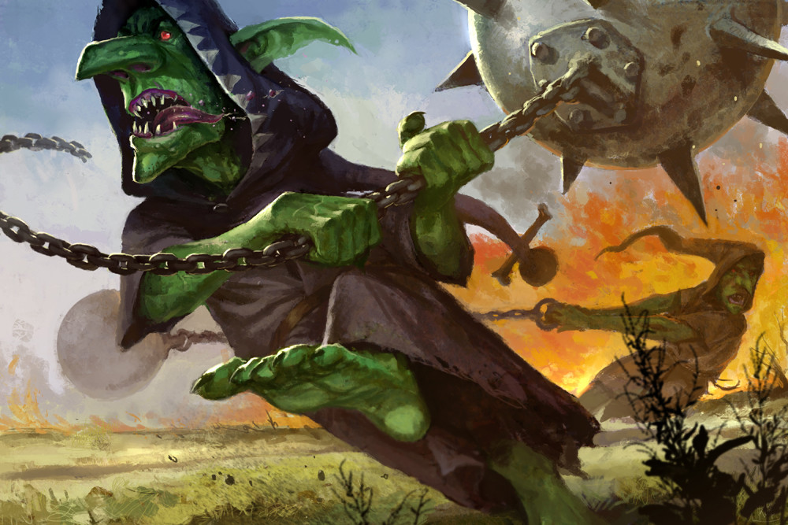
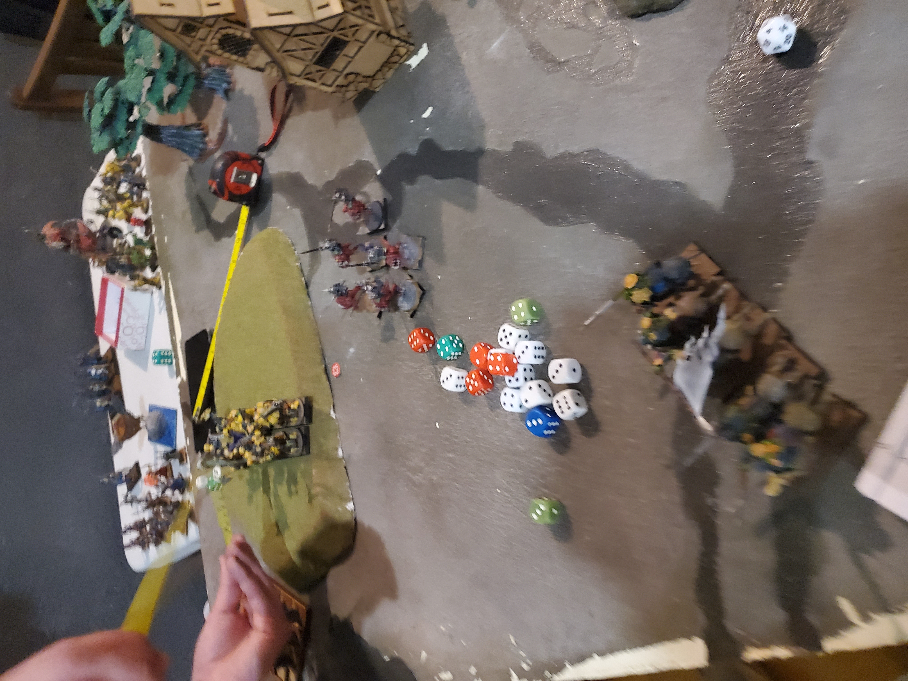

Au nord de la Péninsule Noire ce trouve Thessos, une colonie des Principautés Frontalières située proche du rivages maudits du Golfe Noir. Dans cette endroit des rumeurs circulent sur l’emplacement de la couronne de *Imephep l’Adulé*, un artefact doté de grand pouvoir. Mais les ombres de ce pouvoir attirent plus que les serviteurs de Nehekhara…

Les orques et gobelins de la tribut des **Zouvreurs Ki Brill'**, ivres de pillage et de violence, ont eu vent de l'a découverte l’artéfact. Leur horde déferle comme une marée verte, hurlante et désordonnée, mais déterminée à s’emparer du butin avant que les elfes de la Garde Maritime ne puissent intervenir. Ces derniers, disciplinés et mortels, savent qu’une telle relique ne doit pas tomber entre les mains des peaux-vertes… et sont déterminer à s'en emparer.

Au cœur de ce champ de bataille grisâtre, sillonné de ruisseaux noirs où l’eau semble absorber la lumière, se dresse un édifice ancien, rongé par les siècles et les malédictions. Ses murs, couverts de runes effacées, tremblent sous les assauts des deux armées.

## Résumé immersif

Au coeur du champ de bataille, là où la terre suinte une boue noire qui avale la lumière, se dresse un temple oublié. Ses murs, couverts de runes effacées par le temps et la malédiction, tremblent sous les pas des éclaireurs elfes. Ces derniers, agenouillés dans la poussière, grattent le sol à la recherche de la couronne, ignorants encore que la mort les encercle.

Les orques chargent, hurlants, leurs haches levées vers le ciel. Sur le flanc gauche, la cavalerie elfique, aussi rapide que la foudre, attire les chevaucheurs de sangliers dans un piège mortel. Les bêtes hurlent, les cavaliers peaux-vertes s’écroulent sous une pluie de flèches.

::: {layout-ncol=4}

{group="tour1"}

{group="tour1"}

{group="tour1"}

{group="tour1"}

:::

Au centre, un aigle géant, monté par des elfes, fond sur les gobelins. Ces derniers, hilares et fous, lancent leurs fanatiques drogués sur sa trajectoire. L’aigle blessé lors de son esquive du gobelin fou n'arrive pas se saisir suffisamment des vermines peaux vertes et ce retrouve repoussé. Obligé de se replié il est percuté par un bond chanceux du fanatique et s’écrase dans un geyser de sang et de plumes. Pendant ce temps, le noble griffon elfe, monstre de guerre aux serres d’acier, déchire les chevaucheurs de loups et perce jusqu’au char ennemi, semant la terreur.

Avec la mort l'aigle, **M'ek Ki dens** le chaman gobelin ordonne la fouille de l'édifice. Les gobelins, avides, commencent à chercher. Six d’entre eux meurent dans d’horribles cris, leurs corps déchiquetés par des pièges anciens. Pendant ce temps, les orques noirs, plus disciplinés, massacrent les éclaireurs elfes, tandis que le griffon et son cavalier, occupé à briser le char, ne peut achever sa tâche.

::: columns

::: {.column width="42%"}

:::

::: {.column width="2%"}

:::

::: {.column width="56%"}

Les cavaliers elfes, traqués par les chevaucheurs orques, fuient vers l’est. C'est alors qu'un rugissement retentit dans le champs de bataille lorsque le squig géant se rue sur les archers elfes au centre. Ces derniers, essayeront de prendre la fuite et le seul survivant rencontrera alors une mort horrible en étant écrasés par un fanatique gobelin qui, dans sa course folle, anéantit aussi le monstrueux squig tout en riant.

:::

:::

A l'autre bout du champs de bataille sur la colline les orques noirs et les elfes s’affrontent enfin. Les lames s'entrechoquent, les boucliers volent en éclats. Au milieu de la mélé; le général orque **Krak'O cou**, monstre de muscles et de cicatrices provoque en duel son homologue elfe. Trop confiant dans sa capacité à tuer cette brute, il sera surpris par la vitesse du vétéran et finira brutalement décapité avec la hache magique de l'orque. Cette mort glorieuse sème la panique parmi les elfes, qui, traqués, sont exterminés sans pitié.

En entendant les cries de victoire des peaux vertes au son de « *Krak'O cou c'est l'meilleur* », une seconde fouille gobeline tourne au massacre : six autres peaux-vertes meurent, réduit en charpie. En parallèle, le griffon débarrassé du char est libre de se ruer vers le régiment du mage gobelin. Un fanatique est lancé, et il fait des va et vient eu sein des rang peaux verte alliés, les tuant tous, sauf le mage qui s’enfuit, laissant le griffon seul face devant l'édifice ancien..

C'est alors que les chevaucheurs de sangliers, hurlants, chargent le griffon et commence à le repousser. Le monstre et son cavaliuer elfe, blessé, s’envole alors dans un tourbillon de poussière et de sang, abandonnant le champ de bataille. Les peaux-vertes, survivants hilares et couverts de boue, lèvent leurs armes vers le ciel.

::: {layout-ncol=3}

{group="fin"}

{group="fin"}

{group="fin"}

:::

La victoire revient alors aux peaux vertes, **M'ek Ki dens** survivant in extremis pour rapporter son échec à amener la *Couronne de Imophep l’Adulée* à son maitre Rikiki. Alors que sur le champs de bataille les mourants sont achever et que les survivants orques et gobelin commencent leurs festin quelque part, dans les ombres, quelque chose rit...

*To be continue*

---

Un grand Merci à mon adversaire [**@Podo**]{style="color:Blue"} pour cette partie incroyable, l'aléatoire Orque et Gobs nous a bien fait rire! Cette partie me réconcilie beaucoup avec le système de jeu.
