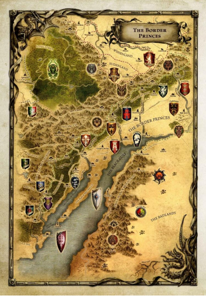
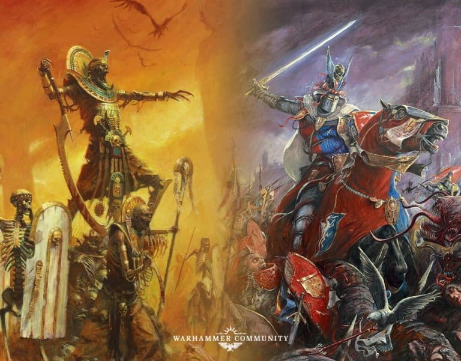
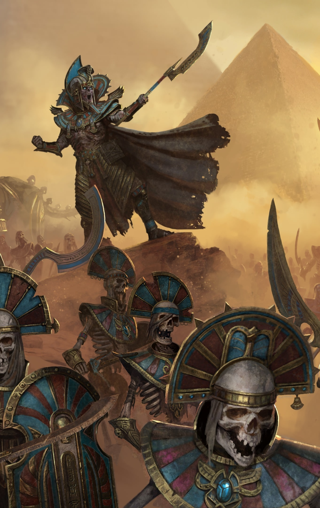

<style>
body {
text-align: justify}
</style>


::: columns

::: {.column width="42%"}


:::

::: {.column width="2%"}

:::

::: {.column width="56%"}
Principautés Frontalières, 2277 après l'avènement de Sigmar. Settra, dans sa quête de vengeance des chevaliers Bretonniens qui ont profané ses terres, poursuit sa route à travers le sud du vieux monde. Alors que ses armées commencent la longue traversée des Voûtes, le grand monarque Nehekharien laisse derrière lui des terres ravagées. Des réfugiés affluent de toutes part, des gouvernements sont renversés. Les bandits profitant de l'absence des milices décimés par les morts vivants, se mettent à proliférer partout. Les Principautés Frontalières sont aujourd'hui encore plus inhospitalières que d'habitude. Pourtant, des aventuriers en provenance de tout le vieux monde arrivent de plus en plus nombreux chaque jour, car des Prêtres Liches de l'Impérissable, restés en retrait pour organiser des fouilles, ont attiré l'attention. Selon les dires, ils chercheraient la couronne de Imephep l'Adulé, puissant souverain qui gouvernait autrefois ces terres lors de l'apogée de Nehekhara. Et la rumeur se repend que quiconque possède cet artefact se voit doté de grand pouvoir !

:::

:::


## Organisation Campagne

Bienvenue dans la Campagne narrative de **la Couronne de Imophep l’Adulée**. Le but de cette campagne sera de jouer uniquement sur des scénarios narratifs, qui impacteront le gameplay et la manière de jouer, mais augmenteront grandement l’immersion. Il y aura également parfois des impacts d'une partie à l'autre afin de rajouter un peu plus de fun et de cohérence, le tout dans une histoire globale qui va évoluer selon vos parties. Le but sera ici est avant tout de jouer du scénario, ne vous attendez pas à 100% d'équilibrage parfait. Mais afin de garantir un minimum d'équilibrage n'hésitez pas à le faire savoir si vous sentez qu'il y a un gros problème, ceci est évènement communautaire.


::: columns

::: {.column width="66%"}

L’idée est de jouer plusieurs parties, peut être 4 ou 5, sur un rythme d’une par mois, organisé en vague, afin de laisser le temps à tout le monde de jouer. Il faudra attendre que tout le monde est joué avant de passer à la vague de scénario suivante. Le tout sera chapoté par votre grand MJ (moi !) afin de lier toutes les histoires entre elles et de vous faire vivre une grande épopée !

:::

::: {.column width="2%"}

:::

::: {.column width="32%"}



:::

:::

De la même manière, afin de se concentrer sur l’aspect narratif et scénario, il n’y a pas de restriction sur la conception d’armée (hormis le fait de jouer en grande mêlée). Vous pouvez varier vos listes d’une partie à l’autre. Il est simplement demandé de resté lore, éviter donc les personnages nommés et les grands seigneurs en personnage car ceux-ci n’ont aucune raison d’être présent lors de cette campagne (ils ont mieux à faire). De la même manière si vos personnages meurt dans une bataille vous pouvez rejouer le même lors de la partie suivante, on considérera qu’il a simplement été blessé. Jouez peint est préférable mais rien d’obligatoire non plus. Les armées légacy avec règle renégate sont autorisés.


Il y a 3 salons à notre disposition dans le discord pour organiser, parler et suivre la campagne. 

- Le premier salon, intitulé « **campagne narrative** » est le salon principal pour échanger.
- Le second salon, intitulé « **campagne organisation** » est le salon ou seront partagé les règles du déroulement de la campagne au fur et à mesure, mais aussi pour vous permettre d’organiser vos parties entre vous
- Le troisième salon, intitulé « **La couronne de Imophep l’Adulée** » est un salon uniquement dédié au narratif. Vous pouvez d’ailleurs ouvrir un fil de discussion pour partager le lore de votre armée ainsi que vos futurs rapport de bataille narratif (si vous le souhaitez, rien n’est obligatoire). Je partagerai également du lore entre chaque vague de scénario vous faire savoir l’avancement de la campagne

## Participants


::: columns

::: {.column width="52%"}

[**Faction Ordre**]{style="color:blue"}

- Finarfin : Hauts elfes
- Podo : Hauts elfes
- Max69 : Hauts elfes
- Benjamin : Elfes Sylvains grande alliance avec esprits de la forêt
- Jean Lama-Nain d'Hashut : Couronne Renegate
- fait faim : Elfes Sylvains
- Aldur : Hommes Lezard
- Akta : Hommes Lezard (ou demon)
- Grumpyfuzzybear : Hommes Lezard
- Gargarysm : Nains
- Maniac : Bretonnien

[**Faction Destruction**]{style="color:green"}

- Dalza : Orc et gob
- lairder1 : Waagh nomad
- propan2one : Orc et gob
- Adie : Comtes Vampires

[**Faction Chaos**]{style="color:red"}

- Nopeace : Nains du chaos
- bonnet100 : Hommes Betes
- Skaragg : Loups de mer

:::

::: {.column width="2%"}

:::

::: {.column width="46%"}



:::

:::

----------------------------------------------------

## Vague 1, mois de mars 2026 - Fouille du site 

Pour ce mois de mars tous les adversaires vont jouer le même scénario, à savoir le scénario « fouille » qui suit :

### L’Héritage des Morts : La Folie d’un Pouvoir Oublié

*L’an 2277 du calendrier impérial, le sud du Vieux Monde tremble sous la marche de Settra. Le monarque nehekharien, traqué par sa soif de vengeance, laisse derrière ses légions un sillage de ruines et de chaos. Les Principautés Frontalières, déjà hostiles, deviennent un piège mortel.Pourtant, une rumeur attire les fous et les ambitieux : la couronne de Imephep l’Adulé, artefact perdu d’un pouvoir légendaire, serait sur le point d’être exhumée par les Prêtres-Liches de Settra. Malgré les dangers, les aventuriers se pressent, prêts à tout pour s’en emparer…*


::: columns

::: {.column width="48%"}

**Mise En Place**

Lors du placement des décors, choisissez une ruine, tour, cimetière ou simple maison que vous positionnerez a distance égale de la zone de déploiement de chaque joueur (donc pas forcément en plein milieu de la table, sur un côté c'est possible).

**Déploiement**

Une fois le champ de bataille mis en place, le gagnant d'un tir au dé choisit quel joueur déploie la première unité. Le gagnant de ce tir au dé doit également choisir sa Zone de Déploiement. Les joueurs déploient alors leurs armées selon la méthode du déploiement alterné.

**Premier Tour**

Une fois le déploiement terminé, faites un tir au dé, et le gagnant prend le premier tour.


**Durée De La Partie**

La bataille durera six rounds, ou jusqu'à ce qu'un camp concède la partie, ou jusqu'à ce que la limite de temps que les joueurs auront décidé à l'avance soit atteinte.

**Victoire !**

- Si personne ne trouve la couronne, le joueur avec le plus de points d'objets à la fin de la partie (6 tours max) gagne.
- Si aucun joueur n'a trouvé d'objet c'est le joueur qui a le plus fouiller qui gagne
- Tout autre résultat est une égalité


**Règles Spéciales Du Scénario**

Lors de la **phase de stratégie**, début de tour, si le joueur a une unité d'infanterie de `PU5` **minimum** à moins de 3" du décors concerné, il peut la faire fouiller à la condition qu'il n'y est pas d'unité adverse, non engagée, qui soit elle aussi à moins de 3" du décors, avec une PU supérieur.
Une fois qu'elle à fouiller l'unité ne peux plus se déplacer, charger ou tirer. Plusieurs unités peuvent fouiller le même tour si elles remplissent les conditions.


:::

::: {.column width="4%"}

:::


::: {.column width="48%"}
Lancer `1D6` pour le résultat de fouille :

-   1: Les ancienne ruines sont parfois pleines de pièges. (L'unité prends 1d6 pv de blessure)

-   2 à 5: Les soldats fouillent les lieux sans succès (Rien ne se passe)

-   6: Les soldats ont trouvé quelque chose (Relancer 1d6:)

    -   1: <u id='lame_de_morsure'>Lame De Morsure</u> (15pts)

    -   2: <u id='armure_de_fer_meteorique'>Armure De Fer Météorique</u> (20 pts)

    -   3: <u id='talisman_de_protection'>Talisman De Protection</u> (30 pts)

    -   4: <u id='armure_de_fer_argent'>Armure De Fer-Argent</u> (40 pts)

    -   5: Marteau Meteore (50 pts)

    -   6: **C'est la couronne !!!**
  
Si la couronne est obtenue, l'unité doit fuir le champs de bataille par son bord de table pour sécuriser l'objet et remporter la partie. La couronne ne peut plus être trouvé dans la partie. À la place c'est le marteau météore qui sera trouvé sur un 5 et un 6.

Les objets trouvés sont portés par un personnage ou le champion de l'unité qui a fouillé. S’il n’y a pas de champion, un soldat au hasard est désigné pour porter les objets. Lorsqu'un objet est trouvé en plusieurs exemplaires par la même unité c'est un autre personnage/soldat qui doit le porter. Il est possible de voler les objets et la couronne en détruisant, ou en mettant en fuite l'ennemie, en possession des objets. L'unité qui a détruit et/ou fait fuir l'ennemie récupère les objets. Le repli en bon ordre n'est pas une fuite. Un seul objet trouvé par un joueur pourra être conservé pour la prochaine partie.

:::

:::


---------------------------

*To be continue...*

```{r, echo=FALSE}
rule_lame_de_morsure <- "Lame de Morsure Combat F utilisateur PA-2 Arme Perforante (1), Attaques Magiques"
rule_armure_de_fer_meteorique <- "L’Armure de Fer Météorique confère à son porteur une valeur d’armure de 5+, qui ne peut être améliorée d’aucune façon. Toutefois, cette valeur d’armure ne peut pas non plus être réduite de quelque façon que ce soit."
rule_talisman_de_protection <- "Le Talisman de Protection confère à son porteur une sauvegarde Invulnérable de 5+ contre toute blessure subie."
rule_armure_de_fer_argent <- "L’Armure de Fer-Argent est une armure qui confère à son porteur une valeur d’armure de 3+ qui ne peut être améliorée d’aucune façon."

# Apply ------------------------------------------------------------------------
tippy::tippy_this(elementId = "lame_de_morsure", tooltip = rule_lame_de_morsure)
tippy::tippy_this(elementId = "armure_de_fer_meteorique", tooltip = rule_armure_de_fer_meteorique)
tippy::tippy_this(elementId = "talisman_de_protection", tooltip = rule_talisman_de_protection)
tippy::tippy_this(elementId = "armure_de_fer_argent", tooltip = rule_armure_de_fer_argent)
```
