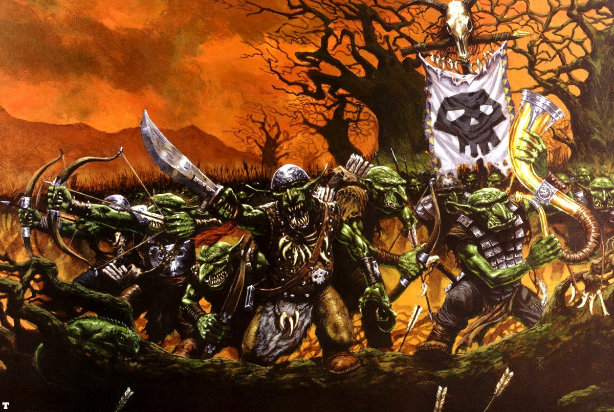
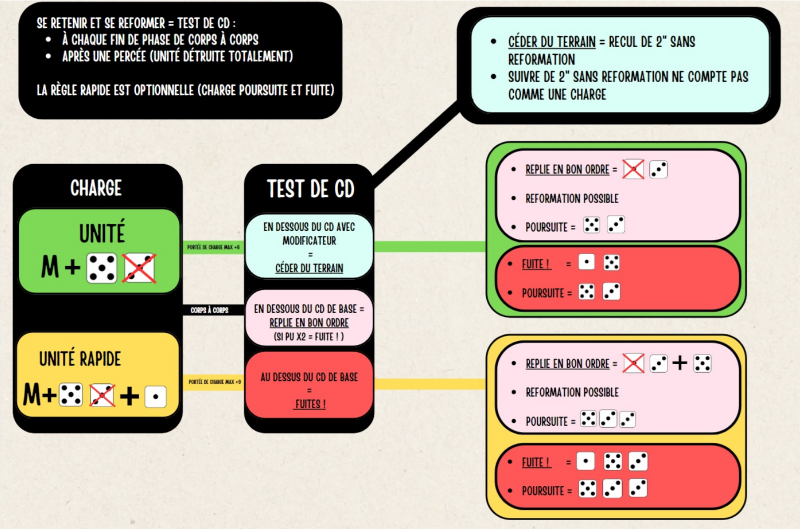

::: columns

::: {.column width="42%"}


:::

::: {.column width="2%"}

:::

::: {.column width="56%"}
**Introduction**: Inspiré par Embackup et son document récapitulatif : [SeqWarfoEmbackO&Gdn](https://touteslesplublicationsgw.com/s/2TbRArpi78Qo9Td?path=%2FLogigrammes%2Fpar%20Embackup). Voici un reformatage du document permettant une meilleur lecture. Les mots souligner renvoi à la règle tandis que des menus déroulants sont signalés sur le côté par un triangle à gauche.

D'autres documents peuvent s'avéré utile comme l'[Aide de jeu v2.2](https://touteslesplublicationsgw.com/s/2TbRArpi78Qo9Td?dir=undefined&path=%2FFeuille%20de%20r%C3%A9f%C3%A9rence%20g%C3%A9n%C3%A9rale&openfile=827462) par TheGuest.

:::

:::

*Remarque sur le document*: Le symbole `[§]` dans les bulles de règles signale que la description a été réccourcie ou modifier tout en essayant de garder la logique de la règle. De plus, les unités peuvent être labelliser par couleur [Orques]{style="color:#3a5f0b"} / [Gobelins]{style="color:#6b8e23"} / [Orques noires]{style="color:#6605bb"} / [Sangliers]{style="color:#52280a"} / [Loups]{style="color:#d4af37"} / [Squig]{style="color:#8b0000"} / [Vouivre]{style="color:#84b415"}.

<details>

<summary>Début et mise en place de la partie</summary>

<p>

Pour une vue exhaustive des scénarios il est possible de ce référer à [WTOW - Compilation Scénarios Officiels V2.0.pdf](https://touteslesplublicationsgw.com/s/2TbRArpi78Qo9Td?dir=undefined&path=%2FSc%C3%A9narios&openfile=821560).

1)  **Mise en place du champs de bataille**: Placer 1 élément de terrain par section de 12" de longueur de table (arrondi à la section de 12" la plus proche). Par exemple, si la longueur de table est de 72' , six éléments de terrain devraient suffire.
2)  **Sorts & Génération De Sorts**: Les joueurs génèrent aléatoirement des sorts pour chacun de leurs Sorciers (p 319).
3)  **Déploiement Alterné** : le gagnant du jet dé choisit quel joueur déploie la première unité.
4)  **Déterminer qui a le 1er tour** : le gagnant du jet dé choisit qui commence en 1er.

</p>

</details>

------------------------------------------------------------------------

## I. Phase de Stratégie

<a id="top"></a>

### 1) Début du Tour

-   <u id='stupide'>Stupidité</u> ➜ si non engagé, faire un <u id='test_commandement'>test de commandement</u> **égale au propre** (Cd 5) ou présence charismatique (Voir I, 4.2) marquer d’un token la stupidité pour la phase de mouvement aléatoire en cas d’échec.

-   Éventuel <u id='lacher_fanatique'>Lâcher des fanatiques</u> à 3” de son régiment (HS p 26)

-   Mouvements aléatoires des Vortex, comme <u id='pied_de_gork'>Pied de Gork</u>, et résolution des blessures (p 95,107) (si pertes éventuelle = <u id='test_de_panique'>Test de Panique</u> voir phase de tir 5).

### 2) Commandement


-   <u id='waaagh'>Waaagh!</u> une fois par partie ! éventuel des Chefs orques sur un <u id='test_commandement'>test de commandement</u> ➜ donne `relance des 1` à la touche valable sur le round complet (HS p46).

-   <u id='cri_de_ralliement'>Cri de ralliement</u> 1 fois par Chefs peaux verte à portée de commandement des unités fuillardes (p 176 tests de ralliement gratuit avant phase I.4).

-   Boire les potions éventuelles (p 342).

### 3) Conjuration

-   <u id='dissipation'>Dissiper</u> les sorts restés en jeu si portée (penser aux objets cabalistique bonus comme <u id='effigie_de_mork'>Effigie de Mork</u> et dissipation fatidique (p 110).

-   Lancer les **Enchantements et Maléfices**. Notamment l'<u id='urticaire_ultime'>urticaire ultime</u> / <u id='lever_dla_mauvaise_lune'>Lever D’La Mauvaise Lune</u> / <u id='leklat_du_soleil_malefikk'>L'Éklat Du Soleil Maléfikk</u> / <u id='on_y_va'>On Y Va !</u> / <u id='malediction_de_mork'>Malédiction de Mork</u>. Ne pas oublié la Loi du nombre : Si chaman orque dans pack a PU 10 ➜ +1 au lancement de sort (HS 14).

<details>

<summary>Détails autres Enchantements et Maléfices possibles</summary>

<p>

-   Illusionnisme \> (p 330) E Robe étincelante
-   Elementalisme \> (p 326) 4 Rempart tellurique
-   Bataille \> (p 321), 5 Bouclier de Chêne Lancer les Maléfices :
-   Illusionnisme \> (p 330) 4 Convocation déconcertante, 6 Mirage Miasmique
-   Elementalisme \> (p 326), E Appeler la tempête
-   Bataille \> (p 321), 2 Malédiction d’attraction des flèches, 6 Malédiction de couardise.

</p>

</details>


### 4) Rallier les Troupes en Fuite

Chaque unité en fuite effectue un <u id='test_commandement'>test de commandement</u> (Cd) pour tenter un ralliement (penser à présence charismatique), overview <u id='commandement_og'> O&G CD</u>.

-   *i)* Si le nombre de figurines est `< 50%` alors **-1 CD**
-   *ii)* Si `< 25%` alors **double 1 nécessaire**
-   *iii)* Si il y a un musicien alors **+1 CD**
-   *iv)* La GB permet une relance à 12 pouces si le ralliement est raté (Tenez vos rangs p203),
-   *v)* Présence Charismatique du général donne aux unités la caractéristique de commandement (p203).
-   *vi)* Bande de guerre permet d’augmenter la capacité de Cd d’une unité en additionnant ses bonus de rang en jeu(p 180).

Le résultats va déterminer le comportement de l'unité :

-   Si [**échec**]{style="color:red"}, marquer d’un token fuite pour la phase de mouvement obligatoire.
-   Si [**réussite**]{style="color:green"} l’ unité est rallié ( -1 aux tirs ( se déplacer et tirer, sauf ), gagne une reformation gratuite et ne peut charger ni ce déplacer.

------------------------------------------------------------------------

## II. Phase de Mouvement

### 1) Déclarer les Charges & Réactions aux Charges (p119)

Déclarer toutes les charges c'est à dire vérifier la portée en prenant comme valeur de(<u id='mouvement_og'>mouvement</u>) + `6` (cad min 1') avec tous les modificateurs précédemment évoqué. Ne pas oublier de **payer les roues obligatoires** de charge dans la portée pour que la charge soit réellement possible.

| Orque     | Gobs      | Orque noir | Sanglier*   | Araignée*   | Loup*       | Vouivre*    | Squig |
| :-------  | :-------- | :--------- | :---------- | :---------- | :---------- | :---------- | :---- |
| M4>10 (7) | M4>10 (7) | M4>10 (7)  | M7>16 (14)  | M7>16 (14)  | M9>18 (15)  |  M9>18 (15) | 3D6   |

**Tableau des portées de charge**. Le résultat entre parenthèse prends en compte le maximum de vraisemblance en prenant en compte les <u id='rapide'>rapides</u>.

<details>

<summary>Résumé Déclaration Charges & leurs Réactions</summary>

<p>

Le joueur actif déclare ses charges, en indiquant lesquelles de ses unités chargent, et quelle unité ennemie chaque charge :

-   Une unité qui charge doit pouvoir tracer une ligne de vue vers l'unité qu'elle veut charger.

-   Les unités en Colonne de Marche, engagées en combat ou en fuite ne peuvent pas charger.

Réactions aux Charges : Quand elle est chargée, une unité peut déclarer une réaction à la charge :

-   Tenir sa Position : L'unité s'apprête à recevoir la charge.

-   Tenir sa Position & Tirer : L'unité utilise ses armes de tir contre l'unité en charge. On ne peut pas déclarer cette réaction si la distance entre les unités est inférieure à la caractéristique de Mouvement de l'unité en charge.

-   Fuite : L'unité fuit directement à l'opposé de l'unité en charge.

</p>

</details>

[**Points à prendre en compte à cette phase**]{style="color:blue"}

-   Appliquer la Règle <u id='impetueux'>impétueux</u> (p 172) pour les peaux vertes commun l'unité doit faire un <u id='test_commandement'>test de commandement</u> (overview <u id='commandement_og'> O&G CD</u>). Si bulle de 6 à côté d’un orque noir, elle peut re-roll ce test [FAQ 1.5.2](https://www.warhammer-community.com/en-gb/downloads/warhammer-the-old-world/). En cas d'échec, l'unité doit déclarer une charge.
    -   [Attention]{style="color:Orange"} : le <u id='test_commandement'>test de CD</u> ne prends pas en compte le bonus <u id='bande_de_guerre'>bande de guerre</u> (faq 1.5.1 p4).
-   <u id='peur'>Peur</u> des elfes \[*Gobelins*\]: Si déclaration de charge contre une unité qui fait peur ➜ Test de Cd : en cas d'échec l'unité reste sur place, sinon ➜ charge non modifier.
-   Pour les unités <u id='rapide'>rapide</u> \[*Vouivre*, *loups*, *sanglier*\] ➜ appliquer +3 en porté (page 178)
-   Ne pas oublier que les [Loups]{style="color:#d4af37"} sont  des <u id='escorteurs_de_chars'>Escorteurs De Chars</u>.
-   En terrain difficile ➜ appliquer -1 en portée de charge (p 269 ,119 et 13)
-   Si unités <u id='stupide'>stupide</u> \[*trolls*\] ➜ impossible de charger (p 178)
-   Grande cible, Une fig grande cible peut tracer une ligne de vue sur une autre grande cible à travers d’autres unités (p 172)
-   Pour la bannière Waaagh ➜ appliquer +3 en portée maximum de charge (HS page 43)
-   Escorteur de chars \[*loups*, *sanglier*\] : Les chars peuvent déclarer et charger à travers les unités ayant cette règle en formation de tirailleur (p 167).
-   Réactions aux déclarations de charge du joueur adverse.
    -   Certaine unités comme les [Chevaucheurs de Sangliers]{style="color:#52280a"} dispose de la règle <u id='contre_charge'>Contre Charge</u>
    -   Les [Chevaucheurs Loups]{style="color:#d4af37"} peuvent avoir une unité avec la règle <u id='fuite_feinte'>fuite feinte</u>.

### 2) Mouvements des charges (page 121)

<details>

<summary>Résumé Mouvements des charges</summary>

<p>

Pour exécuter une charge :

**Déterminer la Portée de Charge** : Jetez deux D6 et défassez le plus bas pour obtenir le jet de Charge. Le jet de Charge, ajouté à la caractéristique de Mouvement de l’unité, donne la portée de charge.

**Déplacer l’Unité en Charge** : Si la portée de charge suffit à atteindre l’unité cible, effectuez un mouvement de charge, comme décrit page 126.

**Charges Râtées** : Si la portée de charge ne suffit pas à atteindre l’unité cible, l’unité en charge se déplace droit vers la cible d’une distance égale au jet de Charge.

**Charger un Ennemi en Fuite** : Quand on charge un ennemi en fuite :

-   Si l’unité en charge entre en contact avec l’unité en fuite, elle effectue une roue pour s’aligner et l’unité en fuite est détruite. L’unité en charge peut effectuer un <u id='test_commandement'>test de commandement</u> pour tenter de se reformer.

-   Si l’unité en charge n’est pas en contact avec l’unité en fuite, elle avance d’une distance égale à la portée de charge et atteint l’intégralité de sa cible.


**Le Mouvement De Charge** :

-   Une unité qui charge doit s’efforcer de placer autant de figurines que possible de son rang frontal en contact socle à socle avec les figurines de l’unité chargée.

-   Une unité qui charge doit se déplacer par l’itinéraire le plus court possible pour atteindre la cible de sa charge.

-   Une unité qui charge doit autant que possible avancer en ligne droite.

-   Après s’être déplacée, une unité qui a chargé doit s’assurer qu’elle est alignée contre la cible de la charge.

-   S’Aligner Sur L’Ennemi: Une fois que l’unité en charge est en contact avec la cible de charge, elle doit si nécessaire effectuer **une deuxième roue, gratuite**, pour amener son front en contact avec le côté de l’unité ennemie qu’elle a chargée, comme indiqué.


</p>

</details>

[**Points à prendre en compte à cette phase**]{style="color:blue"}

-   Si la majorité des figurines d'une unité ont la règle la <u id='bande_de_guerre'>bande de guerre</u>, elle peut relancer son jet de Charge (p 180). C'est le cas pour les [*[Orques]{style="color:#3a5f0b"} / [Gobelins]{style="color:#6b8e23"} / [Orques noires]{style="color:#6605bb"} / [Sangliers]{style="color:#52280a"} / [Loups]{style="color:#d4af37"} / [Squig]{style="color:#8b0000"} / [Vouivre]{style="color:#84b415"}*].
-   Pour les unités <u id='rapide'>rapide</u> ajouter 1 dé supplémentaire à la charge et appliqué le résultats (page 178).
-   Marquer d’un token les unitées \[*Orques Noir*, *sanglier*\] qui ont réussi une <u id='charges_devastatrices'>charges dévastatrices</u> cad qui ont plus de 3" (p 171).

### 3) Mouvements Obligatoires (page 122)

<details>

<summary>Résumé Mouvements Obligatoires</summary>

<p>

D'une manière générale, un joueur peut déplacer ses unités à sa guise dans les limites des règles. Cependant, il peut arriver que ses unités échappent à tout contrôle. Tous les mouvements obligatoires sont effectués à cette sous-phase, après que les charges ont été résolues, maïs avant que tout autre mouvement ait lieu.

**Unités En Fuite**: Les unités qui n'ont pas réussi à se Rallier à la phase de Stratégie continueront de fuir pendant la sous-phase de Mouvements Obligatoires. Les unités en fuite doivent être déplacées au début de cette sous-phase, avant de déplacer toute autre unité soumise à un mouvement obligatoire. Déplacer une unité en fuite est une procédure souvent compliquée. Par conséquent la fuite proprement dite est expliquée plus en détail page 126, après que les bases du mouvement et des manœuvres auront été expliquées.

**Autres Types De Mouvements Obligatoires** : Les autres unités qui doivent se déplacer à la sous-phase des Mouvements Obligatoires suivent les règles de mouvement normales, sauf indication contraire. Toute règle spéciale qui s'applique aux unités qui ont un mouvement obligatoire sera décrite dans leurs règles. Par exemple, certaines unités ont une caractéristique de Mouvement aléatoire. Dans d'autres cas, une unité pourra être obligée de se déplacer dans une direction spécifique, voire dans une direction aléatoire. Quoi qu'il en soit, tous les éventuels mouvements obligatoires sont résolus maintenant, après que toutes les unités en fuite ont été déplacées. Ces mouvements obligatoires peuvent être résolus dans l'ordre choisi par le joueur en contrôle.

</p>

</details>

[**Points à prendre en compte à cette phase**]{style="color:blue"}

-   Faire les mouvements de <u id='fuite'>fuite</u> (p132)
-   Il est possible de faire des <u id='marche_force'>Marche forcée</u> mais il y a des restriction si un enemie est proche.
-   <u id='mouvement_fanatique'>Mouvements des fanatiques</u>: un hit étant compté sur place et les doubles détruise le fanatique. (HS p 26) (si pertes éventuelle = <u id='test_de_panique'>Test de Panique</u> voir phase de tir 4). Les Fanatique infligent `1D6 F5 PA-2` dégats.
-   Déplacer les unités \[*squig*\] à <u id='mouvement_aleatoire'>mouvement aléatoire</u> et charger si besoin (p176 et errata 1.2 1).

### 4) Mouvements Restants

| Orque  | Gobs   | Orque noir | Sanglier | Araignée | Loup    | Vouivre      | Squig |
| :----- | :----- | :--------- | :------- | :------- | :------ | :----------- | :---- |
| M4 (8) | M4 (8) | M4 (8)     | M7 (14)  | M7 (14)  | M9 (18) | M4 Vol9 (18) | 3D6   |
**Tableau des mouvements des O&G**. Entre parenthèse ce sont les marches forcé qui sont affichées.

<details>

<summary>Résumé Mouvements Restants</summary>

<p>

Une fois les charges et mouvements obligatoires résolus, vous pouvez maintenant déplacer le reste de votre armée. Si elle na pas l'élan dramatique de la charge ou le suspense des mouvements obligatoires, la sous-phase des Mouvements Restants nen est pas moins importante.

Pendant cette sous-phase, les joueurs manœuvrent leurs unités restantes pour préparer des charges pour les tours à venir, et pour tenter de déjouer les futures charges de leur adversaire. C'est également le moment de manœuvre les troupes de tir et les Sorciers afin qu'ils aient des cibles intéressantes, de semparer de zones importantes du champ de bataille, et ainsi de suite. Enfin, les sorts de Transfert peuvent être lancés à n'importe quel moment de cette sous-phase.

Notez que les unités qui fuient, qui ont chargé à ce tour ou qui se sont déplacées à la sous-phase de Mouvements Obligatoires ne peuvent pas se déplacer à nouveau pendant cette sous-phase. Leur mouvement pour le tour a en effet déjà été effectué.

</p>

</details>

[**Points à prendre en compte à cette phase**]{style="color:blue"}


-   Escorteur de chars : Les chars peuvent se déplacer à travers les unités ayant cette règle en formation de tirailleur (p 167).
-   Les \[*Vouivre*, et *char à sanglier*\] on la règle <u id='pesant'>pesant</u>.
-   Avec ordre dispersé après un mouvement non modifié (sans marche forcée), peut changer son orientation jusqu’ à 90° (p 183)
-   Avec cavalerie <u id='rapide'>rapide</u> en ordre dispersée \[*loups*\], même avec une marche forcée peut changer son orientation jusqu'à 90° (p 168).
-   Si une unité traverse un terrain difficile ➜ `-1` au mouvement.
-   Si une unité commence, traverse, fini sur un terrain dangereux ➜ Test 1D6 sur `1` cela entraine 1pv perdu (p 269).
-   Si l’unité fini avec ¼ ou + en terrains difficile ou obstacle linéaire bas voir unités désorganisées cad qui ne bénéficie pas de bonus de rang (p 101) en le signifiant d’un token.(p 194)
-   Voir terrain dangereux
-   Le vol permet de passer à travers les éléments terrains et unités ignore leurs pénalités(p170)
-   Jouer les [sorts de Transfert]{style="color:Orange"} éventuel.
-   Ennemi repéré (p 123) ➜ si Marche Forcée à 8 d' un adversaire, faire un <u id='test_commandement'>test de commandement</u> (+1 =cadence rapide p 201) ➜ réussite= ok, échec ➜ pas de marche forcée. Le vol ignore ce <u id='test_commandement'>test de commandement</u> (p 180).

## III. Phase de Tir

-   Les [Orques]{style="color:#3a5f0b"} ont des <u id='arc_de_guerre'>Arcs de Guerre</u> lesquelles ont la règle <u id='tir_de_Volee'>Tir de Volée</u> 
-   Les [Gobelins]{style="color:#6b8e23"} ont des <u id='arc_court'>Arcs Court</u> lesquelles ont les règles <u id='tir_rapide'>Tir rapide</u> et <u id='tir_de_Volee'>Tir de Volée</u> 

<details>

<summary>Résumé Phase de Tir</summary>

<p>

La phase de Tir se décompose en sous-phases, et on la suit intégralement pour chaque unité qui tire, une par une :

1.  Choisir l'Unité & Déclarer La Cible (p.137) Une unité est choisie pour tirer et sa cible est déclarée.

2.  Jet De Toucher (page 138) Pour voir si vos figurines touchent, effectuez un jet de Toucher en consultant le tableau ci-dessous, selon leur Capacité de Tir :

Un ou plusieurs des modificateurs suivants peuvent s'appliquer à vos jets de Toucher :

-   Se Déplacer et Tirer: -1
-   Tirer à Longue Portée: -1
-   Tenir sa Position et Tirer: -1
-   Cible Derrière un Couvert Léger: -1
-   Cible Derrière un Couvert Lourd: -2

3.  Jets De Blessure & Sauvegardes d'Armure (page 140) Jet de Blessure : Pour chaque touche, faites un jet de Blessure, en recoupant la Force de l'arme et l'Endurance de la cible sur le tableau ci-dessous :

Sauvegardes d'Armure : Pour chaque blessure, votre adversaire fait un jet de Sauvegarde d'Armure, comme décrit page 141.

</p>

</details>

### 1) Choisir l’Unité & Déclarer la Cible (page 137)

-   Une unité [**ne peut pas tirer**]{style="color:red"} ou **lancer un vortex et projectile** si elle a **chargé** ou effectué une **marche forcée** (p 137).
-   Vérifier les lignes de vue comme décrit page 103 et vérifier la portée.
-   **Vortex et projectiles magiques éventuels** en sachant Loi du nombre ➜ Si chaman orque dans pack à PU 10 \>+1 au lancement de sort (HS p14) :
    -   Magie Waagh ➜ <u id='kraz_tête'>Kraz'Tête</u> / <u id='regard_de_gork'>Regard de Gork</u> / <u id='poing_de_gork'>Poing De Gork</u> / <u id='regard_vindicatif'>Regard Vindicatif</u> / <u id='pied_de_gork'>Pied de Gork</u>.
    -   Illusionisme\> 1 Rasoir Mental, 3 Colonne de cristal (p 331)
    -   Elementalisme\> 3 Invocation d’Esprit Elémental, 5 Bourasque (p 327)
    -   Magie de Bataille\> 1 Boule de feu, 3 Pilier de Flammes (p321)

### 2) Jets de Touche (page 138)

-   Les [Orques]{style="color:#3a5f0b"} et les [Gobelins]{style="color:#6b8e23"} ont des `CT3`.
-   Baliste : voir page HS 40, page 223 et voir page 197 pour machine de guerre.
-   Tir rapide des Arcs Court ne subit pas -1 au jet de touche quand ce déplace et tire compte aussi après un ralliement (p 170).
-   Pour obtenir le [**jet de touche d’un tir soustraire à 7 la capacité de tir (CT)**]{style="color:Green"} de l’unité puis appliquer le modificateur qui suivent :
    -   Se déplacer et Tirer -1 (*sauf arcs court des Gobs car <u id='tir_rapide'>Tir rapide</u>*)
    -   Tirer à longue portée -1
    -   Tenir sa position et Tirer -1
    -   Cible derrière un couvert Léger -1
    -   Cible derrière un couvert Lourd -2

### 3) Jets de blessure & Sauvegardes d’Armure (page 140)

-   Mouvement de réserve (payant) \[*Gobs sur loups*\] : Si l’ unité n’ a pas fait de marche forcée un mouvement supplémentaire non modifié peut être effectué après les tirs du joueur en contrôle.
-   Jet de sauvegarde: dépends de l'<u id='armures'>armure</u> que porte la figurine (Récapitulatif <u id='svg_og'>svg O&G</u>).

### 4) Retrait des Pertes & Tests de Panique (page 142)

-   Un <u id='test_de_panique'>Test de Panique</u> est un <u id='test_commandement'>test de commandement</u> de l’unité ou présence charismatique (Voir I, 4.2)
    -   Si [**réussite**]{style="color:green"}, rien ne ce passe (p 142).
    -   Si [**échec**]{style="color:red"} deux cas de figure. *i)* Si l'unité à un effectif `≥50%` de ses effectifs initiaux c’est un <u id='repli_en_bon_ordre'>repli en bon ordre</u>. *ii)* Si l'unité à un effectif `<50%` de ses effectifs initiaux, celle-ci <u id='fuite'>fuit</u>.

Effectuer ce test :

-   Si perte de 25% ou plus de son effectif initial hors phase de corps à corps.
-   Si à `6"` d’une unité de `PU5` ou plus qui  <u id='fuite'>fuit</u>, ou se repli en bonne ordre ou est totalement détruite.
-   Si l’unité est traversée par une unité amie.

<details>

<summary>Tableau récap morale au tir</summary>

<p>

| Condition                                                                 | Résultat           |
|---------------------------------------------------------------------------|--------------------|
| **Suite à de Lourdes Pertes (Tir) :**                                     |                    |
| Eff. restants \> 50%                                                      | Repli en Bon Ordre |
| Eff. restants ≤ 50%                                                       | Fuite              |
| **Traversée par une unité amie en Fuite ou qui se Replie en Bon Ordre :** |                    |
| Jet \> Cd                                                                 | Fuite              |
| **Ralliement :**                                                          |                    |
| Eff. restants ≤ 50%                                                       | Jet ≤ Cd -1        |
| Eff. restants \< 25%                                                      | Jet ≤ Double 1     |
| Jet \> Cd                                                                 | Fuite              |

</p>

</details>

------------------------------------------------------------------------

## IV. Phase de Combat

<details>

<summary>Résumé Phase de Combat</summary>

<p>

La phase de Combat se décompose en sous-phases.

**Choisir & Livrer Les Combats (page 145)** Cette sous-phase se décompose en étapes comme suit :

**1.1 Choisir les Combats & Déterminer Qui Peut Combattre** : Le joueur actif choisit l'ordre de résolution des combats. Chaque combat doit être résolu avant de passer au suivant. Chaque combat se résout dans l'ordre d'Initiative. Les figurines d'une unité en charge gagnent un bonus à leur Initiative pour le reste du tour, selon la distance parcourue.

-   **Charger L'Arc Frontal d'un Ennemi**: +1 en Initiative par pouce complet parcouru, jusqu'à un **maximum de +3**.

-   **Charger L'Arc Latéral ou Arrière d'un Ennemi**: +1 Initiative par pouce complet parcouru, jusqu'à un maximum de +4.

Chaque figurine du rang combattant peut attaquer, bien que les figurines qui ne sont pas en contact socle à socle avec l'unité ennemie ne puissent effectuer qu'une attaque chacun, quelle que soit la valeur de leur caractéristique d'Attaques.

**1.2 Jets de Touche** : Faites un jet de Touches pour chaque figurine attaquante, en comparant sa Capacité de Combat à celle de la figurine cible:

**1.3. Jets de Blessure & Sauvegardes d'Armure** : Pour chaque touche, faites un jet de Blessure et un jet de Sauvegarde d'Armure comme pour les attaques de Tir.

**1.4. Retrait des Pertes** : On retire les pertes normalement du rang arrière de l'unité, pour représenter les membres des rangs arrière s'avançant pour combler les brèches. Une figurine ne peut pas attaquer lors d'une phase à laquelle elle a fait un pas en avant, comme décrit page 150.

</p>

</details>

### 1) Choisir les Combats & Déterminer Qui Peut Combattre (p145)

[**Points à prendre en compte à cette phase**]{style="color:blue"}

-   Lancer ou non des Défis comme décrit page 210 et 211 Héros comme champions. Les défis ne peuvent être lancés/relevés que par une figurine du rang combattant ou adjacent à celui ci.
-   Un perso ne peut pas de traverser les rangs si déjà dans le rang combattant (FAQ).
-   Une figurine, d’une unité engagée sur plusieurs fronts, qui est à plus de 1 rang combattant doit, si possible, combattre un ennemi en contact socle à socle, sinon elle effectue ses attaques sur l’unité ennemie la plus proche.
-   Une unité en combat peut changer d’arme à toute sous-phase 4.1

<details>

<summary>Description de qui peu taper</summary>

<p>

-   Toute figurine en contact socle à socle fait toutes ses attaques (même si le contact est de flanc ou de dos, y compris juste un coin de socle)
-   Toute figurine du **rang / colonne combattant** (au moins une fig. en contact socle à socle avec l’ennemi) peut combattre l’ennemi si sa distance avec lui est ≤ à son Mouvement (non Vol) et doit alors faire toutes ses attaques.
-   Toute figurine du rang / colonne combattant, **non en contact socle à socle** avec l’ennemi, peut faire 1 seule attaque par figurine de son profil mixte (≈1 attaque par ligne de profil mixte).
-   Sauf en charge, Infanterie Régulière / Lourde : rang combattant = 2 rangs
-   Une **<u id='attaque_soutien'>attaque de soutien</u>** via une arme se fait si le porteur est juste derrière le rang combattant et à distance de l’ennemi ≤ à son mouvement (non Vol), de face.
-   Une figurine en contact socle à socle avec plusieurs ennemis peut choisir lequel cibler, y compris répartir ses attaques (avant les jets de touche)
-   Une figurine du rang combattant engagé avec plusieurs ennemis, non en contact socle à socle, doit faire son attaque contre l’ennemi le + proche.

</p>

</details>

### 2) Nombre d'attaque et ordre d'attaque

Overview CAC O&G : <u id='cac_hero_og'>Héro O&G</u> et <u id='cac_troupes_og'>Troupes O&G</u>.

**Initiative**

-   Toute figurine du rang combattant tuée avant son initiative n’attaque pas.
-   Les  <u id='touches_impact'>touches d’impacts</u> ont `I10` (p 172).
-   Ajouter `+1I` par pouce complet parcouru, jusqu'à un maximum de `+3` de front et `+4` pour flanc/arrière.
-   Le <u id='pietinement'>piétinement</u> est résolu en dernier après les attaques à `I1` (p 177).
-   Les armes lourdes ont la règle frappent en dernier (p 214,p 176, Erra 2).
-   Les unités frappent par Initiative (I) modifiable (max. 10) par les armes et la distance de charge (`+1I` par pouce, max. `+3` dans l’arc frontal adverse, max. `+4I` dans l’arc latéral / flanc / arrière / dos) ; une charge Désordonnée (si la cible défend un obstacle linéaire bas ou si l’attaquant ne peut pas s’aligner sur la cible à cause d’un obstacle - p.128) annule ce bonus d’I.
-   Si les figurines des deux camps ont la même valeur d’initiative après application des modificateurs, résoudre les attaques simultanément.


**Attaque**

-   Compter le `+1A` en attaque des unitées \[*Orques Noir*, *sanglier*\] avec le token de <u id='charges_devastatrices'>charges dévastatrices</u>.
-   Sort d’assaillement éventuelle en fonction de l’ initiative du lanceur:
    -   Magie Waagh \> (p 334) <u id='poing_de_gork'>Poing de Mork</u> & <u id='kraz_tête'>Kraz Tête</u>
    -   Illusionnisme \> (p 331) 5 Double Spectral, Elementalisme \> (p 326) 1 Epée Enflammée, Bataille \> (p 320), Main de Marteau.

### 3) Jet pour toucher

Les [Orques noires]{style="color:#6605bb"} et les [Squig]{style="color:#8b0000"} ont des `CC4`. Les [Orques]{style="color:#3a5f0b"}, les [Sangliers]{style="color:#52280a"} et [Loups]{style="color:#d4af37"} les `CC3` et les [Gobelins]{style="color:#6b8e23"} ont des `CC2` (Overview CAC O&G : <u id='cac_hero_og'>Héro O&G</u> et <u id='cac_troupes_og'>Troupes O&G</u>).

| CC Attaquant / à CC Défenseur | [Moins de la moitié]{style="color:red"} | [Égale ou inférieure]{style="color:orange"} | [Supérieure]{style="color:green"} | [Plus du double]{style="color:#84b415"} |
| :-------------------------------------- | :-------------------- | :------------------ | :--------- | :------------- |
| Résultat requis                         | [5]{style="color:red"}| [4]{style="color:orange"} | [3]{style="color:green"}  | [2]{style="color:#84b415"}              |
**Tableau décrivant les jets pour toucher**. Un `1 naturel` est toujours un échec tandis qu'un `6 naturel` est toujours un succès.

-   <u id='peur'>Peur</u> ➜ si l’unité engagé au combat a une PU moins élevé alors il faut faire un <u id='test_commandement'>test de commandement</u>. *i)* En cas de réussite il n'y a pas de malus, ii) en cas d'échec l'unité à peur et subit `-1 CC`.
-   Si la <u id='waaagh'>Waaagh!</u> est active `relance des 1` à la touche.
-   Les <u id='touches_impact'>touches d’impacts</u> des chars à [Sangliers]{style="color:#52280a"} `D6+1 F5` et à [Loups]{style="color:#d4af37"} `D3+1 F5` + sangliers Waaagh nomade touchent automatiquement (p 172) et `D6 F6` pour les Squigs Broyeurs.
-   Les les Squigs Broyeurs (`D3 F6`) on des attaques de <u id='pietinement'>piétinement</u> qui touchent automatiquement (p 177).
-   Ne pas oublier la <u id='haine'>haine</u> des nains pour les gob de la nuit.

### 4) Jets de Blessure (page 149)

les [Squig]{style="color:#8b0000"} et les Trolls ont des `F5`. Les [Orques noires]{style="color:#6605bb"} et les Orques <u id='kostos'>Kostos</u> ont des `F4`. Les [Orques]{style="color:#3a5f0b"}, les [Gobelins]{style="color:#6b8e23"} les [Sangliers]{style="color:#52280a"} et [Loups]{style="color:#d4af37"} les `F3` (Overview CAC O&G : <u id='cac_hero_og'>Héro O&G</u> et <u id='cac_troupes_og'>Troupes O&G</u>).

-   Si charge effective avec <u id='kikoup'>Kikoup</u> ➜ `relance des 1` à la blessure & `PA-1` à la sauvegarde sur les **6 pour blesser** . (HS p 45).
-   <u id='charge_de_sanglier'>Charges de sanglier</u> (HS p 46) Si charge ➜ `+1 F`.
-   <u id='kostos'>Kostos</u> (payant) ➜ `+1F`(HS p 45).
-   <u id='arme_lourde'>Arme lourde</u> octroi ➜ `+2F` (p 214).
-   <u id='lance_cavalerie'>Lance de cavalerie</u> pour les [chevaucheurs de Sangliers]{style="color:#52280a"}. Par contre les <u id='attaque_soutien'>attaque de soutien</u> sur les côtés et sur 2 rangs ne sont pas comptabilisées.
-   Rétiaires (payant) : A n’importe quelle sous phase de combat: lancé 1d6 et sur 2+ appliquer `-1 force` à l'ennemie ou sinon à soi même (Hs 25).
-   Le Squig Broyeurs à <u id='coup_fatal'>Coup Fatal</u>.

<details>

<summary>Matrice blessure</summary>

<p>

Overview CAC O&G : <u id='cac_hero_og'>Héro O&G</u> et <u id='cac_troupes_og'>Troupes O&G</u>.

**Force de l'Arme (1er colonne) Endurance de la Cible (1er ligne)**

|   F/E | 1   | 2   | 3   | 4   | 5   | 6   | 7   | 8   | 9   | 10  |
|-------|-----|-----|-----|-----|-----|-----|-----|-----|-----|-----|
| **1** | 4+  | 5+  | 5+  | 5+  | 6+  | 6+  | \-  | \-  | \-  | \-  |
| **2** | 3+  | 4+  | 5+  | 5+  | 6+  | 6+  | \-  | \-  | \-  | \-  |
| **3** | 3+  | 3+  | 4+  | 5+  | 5+  | 6+  | \-  | \-  | \-  | \-  |
| **4** | 2+  | 3+  | 4+  | 5+  | 5+  | 6+  | \-  | \-  | \-  | \-  |
| **5** | 2+  | 3+  | 4+  | 4+  | 5+  | 6+  | 6+  | \-  | \-  | \-  |
| **6** | 2+  | 2+  | 3+  | 4+  | 5+  | 5+  | 6+  | 6+  | \-  | \-  |
| **7** | 2+  | 2+  | 3+  | 4+  | 5+  | 5+  | 5+  | 6+  | 6+  | \-  |
| **8** | 2+  | 2+  | 3+  | 4+  | 4+  | 5+  | 5+  | 5+  | 6+  | 6+  |
| **9** | 2+  | 2+  | 3+  | 4+  | 4+  | 5+  | 5+  | 5+  | 5+  | 6+  |
| **10**| 2+  | 2+  | 3+  | 4+  | 4+  | 5+  | 5+  | 5+  | 5+  | 4+  |

</p>

</details>

### 5) Jets de Sauvegardes d’Armure page & Régénération (page 149)

-   Jet de sauvegarde: dépends de l'<u id='armures'>armure</u> que porte la figurine (Récapitulatif <u id='svg_og'>svg O&G</u>).
-   Ne pas oublier la règle <u id='parade'>Parade</u> pour l'infanterie.
-   <u id='kikoup'>Kikoup</u> effectif en charge ➜ octroi `PA-1` (HS p 46).
-   <u id='kostos'>Kostos</u> ➜ octroi `PA-1` à la sauvegarde sur les **6 pour blesser** (armes perforantes) (HS p 45).
-   Lance de cavalerie ➜ octroi `PA-1` si charge effective (p215).
-   <u id='charge_de_sanglier'>Charges de sanglier</u> ➜ Si charge `PA-1` sur les attaques des sangliers (HS p 46).
-   Les <u id='touches_impact'>touches d’impacts</u> des chars lourd avec roues garnie de lames ➜ octroi `PA-2` (p 195).
-   Arme lourde ➜ octroi `PA-2` et `PA-3` sur les **6 pour blesser** (p 214)
-   Deux attaques de griffes cruelles à `PA-2` (Hs p 35)
-   Deux attaques Immense gueule(2A) (HS p 27) et Gueule immense (3 A(HS p 20)) ont `PA-1` sur et `PA-2` sur les **6 pour blesser**.

### 6) Calculer le Résultat du Combat (page 151)

L'application [thefateroll](https://thefateroll.com/) fait par Troma permet de calculer les résultats de combats.

-   Ne pas oublier l'<u id='ordre_serre'>Ordre serré</u> si `PU>10`.
-   Ne pas oublier la règle <u id='masse_infanterie'>Masse d'infanterie</u>.
-   La régen compte dans le résultat de combat.

<details>

<summary>Tableau récapitulatif Combat</summary>

<p>

| Résultat                   | Points                     |
|----------------------------|----------------------------|
| Blessures non sauvegardées | 1 point chacune            |
| Bonus de Rang              | +1 point/rang              |
| Bannière                   | +1 point                   |
| Grande Bannière            | +1 point                   |
| Attaque de flanc           | +1 point                   |
| Attaque de dos             | +2 points                  |
| Position dominante         | +1 point                   |
| Carnage                    | +1 point/blessure en excès |
| Autres bonus               | Selon les cas              |

</p>

</details>


### 7) Test de Moral (page 154)

<details>

<summary>Tableau récap morale au CAC</summary>

<p>

| Condition                                                                 | Résultat           |
|----------------------------------------------|--------------------------|
| **Suite à un Combat perdu :**                                             |                    |
| Jet ≤ Cd modifié                                                          | Céder du Terrain   |
| Jet \> Cd modifié                                                         | Repli en Bon Ordre |
| Jet \> Cd                                                                 | Fuite              |
| **Suite à de Lourdes Pertes (Corps à corps) :**                           |                    |
| Jet \> Cd                                                                 | Fuite              |
| **Traversée par une unité amie en Fuite ou qui se Replie en Bon Ordre :** |                    |
| Jet \> Cd                                                                 | Fuite              |
| **Ralliement :**                                                          |                    |
| Eff. restants ≤ 50%                                                       | Jet ≤ Cd -1        |
| Eff. restants \< 25%                                                      | Jet ≤ Double 1     |
| Jet \> Cd                                                                 | Fuite              |

</p>

</details>

-   Certaines unité comme les Squigs Broyeurs sont <u id='immunise_psychologie'>Immunisé à la psychologie</u>.

### 8) Résolution du combat

-   [Attention]{style="color:Orange"}: PU perdant × 2 inférieure au PU vainqueur → <u id='fuite'>Fuite</u> automatique !

<details>

<summary>Diagramme Résolution combat et moral</summary>



<p>

</p>

</details>

1. **<u id='ceder_du_terrain'>Céder du terrain</u>** (recul de 2")
→ Si le total modifié ≤ Commandement
→ OU si vous faites un double 1 (toujours sauvé !)

2. **<u id='repli_en_bon_ordre'>Retraite en bon ordre</u>** (recul du meilleur de 2D6)
→ Si le jet de dés (avant modification) ≤ Commandement
→ MAIS le total modifié > Commandement
→ ET votre Puissance d'Unité × 2 n'est pas inférieure au PU de l'adversaire

3. **<u id='fuite'>Fuite</u>** (fuite de 2D6, peut être rattrapé !)
→ Si le jet de dés (avant modification) > Commandement
→ OU si votre Puissance d'Unité × 2 est inférieure au PU de l'adversaire


#### Suite & Poursuite

- Si l'unité ennemie est totalement détruite, l’unité peut tenter de <u id='se_retenir_et_se_reformer'>se retenir et se reformer</u> (overview <u id='commandement_og'> O&G CD</u>) ou faire une <u id='percee'>percée</u> (overview <u id='mouvement_og'>O&G Mouvement</u>).
  - Notons que si l'unité détruite à une `PU de 5 ou plus` dans ce cas il toutes les unités amies à 6” doivent immédiatement effectuer un <u id='test_de_panique'>Test de Panique</u>.
- Reformation possible après s’être restreint.

<a href="#top">Retour Phase de Stratégie</a>

## V. Points de victoire (pdv)

Pour gagner, un joueur doit avoir plus de 100pdv que sont adversaire. Gagné de diverses façons :

**Morts ou en fuite :**

-   100% du coût en points d’une unité détruite ou qui a fuit du champ de bataille
-   50% du coût en points d’une unité en fuite (arrondiau supérieur)
-   50% du coût en points d’une unité réduite à ≤ 25% de sa PU de départ ou à 25% de ses PV de départ si ça PU=PV de départ (arrondi au supérieur).


**Le roi est mort** : 100 pdv si le général tué, fuit du champ de bataille ou en fuite.

**Trophées de guerre :**

-   50pdv pour chaque bannière.
-   50pdv en plus pour la grande bannière.

**Objectifs de scénarios :** cf scénario.

**Terrains spéciaux :** cf scénario

```{r, echo=FALSE}
# I) ---------------------------------------------------------------------------
rule_stupide <- "À moins d'être en train de fuir ou engagée en combat,une unité ayant cette règle spéciale doit effectuer un test de Stupidité en faisant un test sous sa caractéristique de Commandement à la sous-phase de Début du Tour de chacun de ses tours. En cas d'échec, l'unité cède à la Stupidité. Une unité qui a cédé à la Stupidité : • Ne peut pas se déplacer / Ne peut pas tirer ou lancer de sorts / Ne peut pas tenter de dissipation Magique. / Doit “Tenir sa Position” si elle est chargée par un ennemi."

rule_lacher_fanatique <- "Lâchez les Fanatiques ! Une unité cachette peut lâcher un ou plusieurs des Fanatiques à n'importe quelle sous-phase de Début de Tour. Quand un Fanatique est lâché, il bondit dans les airs pour atterrir en tourbillonnant à plusieurs mètres de son unité cachette, avant de commencer son parcours erratique à travers le champ de bataille. Pour représenter cela, placez la figurine de sorte que son socle soit à 3” de son unité cachette, et qu'elle n'atteigne pas le socle d'aucune autre figurine. Il ce déplacera de 2D6 dans la direction choisi lors de sa sortie. [§]"

rule_mouvement_fanatique <- "Pendant la sous-phase de Mouvements Obligatoires du tour où il a été lâché, un Fanatique se déplace de 2D6” dans une direction choisie par son joueur en contrôle. À chacune des autres sous-phases de Mouvements Obligatoires, un Fanatique se déplace de 2D6” dans une direction aléatoire. Si le mouvement d’un Fanatique l’amène en contact avec une unité (amie ou ennemie), il traverse cette unité. Continuez à le déplacer dans la même direction jusqu’à ce qu’il puisse être placé sur le champ de bataille de sorte que son socle ne touche le socle d’aucune autre figurine."

rule_waaagh <- "Une fois par partie, pendant la sous-phase de Commandement de son tour, ce personnage peut tenter d'invoquer le pouvoir de la Waaagh ! en effectuant un test de Commandement (en utilisant son propre Commandement). En cas de réussite, jusqu'à votre prochaine sous-phase de Début de Tour, ce personnage, sa monture et toute unité Orques qui le rejoint peuvent relancer n’importe quel nombre de 1 naturels aux résultats des jets de Touche et, quand on calcule son résultat de combat, peut recevoir un bonus de +1 point de résultat de combat supplémentaire. [§]"

rule_cri_de_ralliement <- "Pendant sa phase de Cd, peut forcer une unité à portée de Cd à faire un test de ralliement."


rule_fuite_feinte <- "Fuite feinte [Feigned Flight] : l'unité se rallie automatiquement après avoir fui en réaction à une charge [§]"

rule_tir_fuite <- "L’unité Tient sa Position & Tire (comme décrit p120) avant de fuir la charge. Quand elle effectue son jet de Fuite, l’unité jette deux D6 et défausse le résultat le plus bas. Notez que si la distance entre cette unité et l’unité qui charge est inférieure à la caractéristique de Mouvement de l’unité qui charge, cette unité doit soit Tenir sa Position, soit Fuir. [§]"

rule_pesant <- "Pesant : compte comme en ordre serré (+1 au résultat du combat si en ordre de combat si PU≥10) même en fig individuelle. Peut pivoter après mouvement jusqu’à 90° (sauf si marche forcée ou fuite). Ne peut pas être rejointe par un personnage."

## Magie
rule_dissipation <- "La portée de Dissipation varie selon le Niveau du Sorcier désigné : Niveau 1 et 2 ➜ portée de 18” / Niveau 3 et 4 ➜ portée de 24”. Les Sorciers engagés en combat, qui sont en fuite ou qui ne sont pas sur le champ de bataille ne peuvent pas être désignés. Jetez 2D6 et , ajoutez le Niveau du Sorcier au résultat de ce jet pour obtenir le 'résultat de dissipation'. Dénouement = double 6 ➜ dissipation | Surclassé double 1 ➜ jet sur le tableau des Fiascos [§]"

rule_effigie_de_mork <- "Le porteur de l’Idole de Mork augmente sa portée de Dissipation de 3”. En outre, une fois par tour, quand il tente une dissipation Magique, le porteur de l’Idole de Mork peut relancer le jet de Dissipation."

rule_kraz_tête <- "[Gork default 1 OG] Type : Assaillement / Valeur de Lancement : 10+ / Portée : Combat / Effet : Une seule figurine ennemie avec qui le lanceur est engagé en combat subit une seule touche de Force 6 avec la règle spéciale Blessures Multiples (D3) et sans sauvegarde d’Armure ni de Régénération autorisées (les sauvegardes Invulnérables peuvent être tentées normalement)."

rule_regard_de_gork <- "[Gork default 2 OG] Type : Projectile Magique / Valeur de Lancement : 9+ / Portée : 5D6” / Effet : Tracez une ligne droite de 5D6” de long, à partir du bord du socle du lanceur. Toute figurine (amie ou ennemie) dont le socle se trouve sous cette ligne subit une touche de Force 5, PA -3."

rule_malediction_de_mork <- "[Mork default 1 OG] Type : Maléfice / Valeur de Lancement : 8+ / Portée : 18” / Effet : Reste en Jeu. Tant que ce sort est en jeu, l’unité ennemie visée doit relancer tout jet de Sauvegarde d’Armure ayant donné un 6 naturel."

rule_urticaire_ultime <- "[Mork default 2 OG] Type : Maléfice / Valeur de Lancement : 9+ / Portée : 15” / Effet : Jusqu’à votre prochaine sous-phase de Début de Tour, l’unité ennemie visée subit un modificateur de -D3 à ses caractéristiques d’Endurance et d’Initiative (jusqu’à un minimum de 1)."

rule_poing_de_gork <- "[default Waaagh] Type: Assaillement / Valeur de Lancement : 8+* / Portée : Combat / Effet: Placez un grand (5”) gabarit dexplosion de sorte que son trou central soit directement au-dessus du centre d'une unité avec laquelle le lanceur est engagé en combat. Une fois en place, le gabarit dévie de D3”+1. Toute figurine (amie ou ennemie) dont le socle se trouve sous la  position finale du gabarit risque dêtre touchée (voir p.95) et Les Domaines De Magie subit une seule touche de Force 4 avec une PA de -1."

rule_regard_vindicatif <- "[1 Waaagh] Type : Projectile Magique / Valeur de Lancement : 8+ / Portée : 21” / Effet : L’unité cible ennemie subit une seule touche de Force 7 avec la règle spéciale Blessures Multiples (D3) et sans sauvegarde d’armure autorisée (les sauvegardes invulnérables et de Régénération peuvent être tentées normalement). Ce sort peut cibler une unité ennemie engagée en combat."

rule_main_de_mork <-  "[2 Waaagh] Type : Transfert / Valeur de Lancement : 7+ / Portée : 1” / Effet : Ce sort peut cibler uniquement les personnages amis, mais il peut cibler des personnages engagés en combat. Vous pouvez immédiatement retirer le personnage ciblé du champ de bataille et le replacer n’importe où à 2D” de sa position d’origine, mais pas à plus de 3” de toute figurine ennemie. Toutefois, en cas de double 1, le personnage atterrit mal et perd un seul Point de Vie.Notez que ce sort autorise un personnage à quitter le combat."

rule_lever_dla_mauvaise_lune <- "[3 Waaagh] Type : Maléfice / Valeur de Lancement : 10+ / Portée : 15” / Effet : Jusqu’à la fin de ce tour, l’unité cible ennemie subit un modificateur de -D3 à ses caractéristiques de Capacité de Combat et d’Initiative (jusqu’à un minimum de 1)."

rule_leklat_du_soleil_malefikk <- "[4 Waaagh] Type : Enchantement / Valeur de Lancement : 9+ / Portée : Lanceur / Effet : Jusqu’à votre prochaine sous-phase de Début du Tour, les unités amies qui sont dans la portée de Commandement du lanceur peuvent relancer tout résultat de 1 au jet de Touche, et améliorent la caractéristique de PA de leurs armes de 1."

rule_on_y_va <- "[5 Waaagh] Type : Enchantement / Valeur de Lancement : 8+* / Portée : Lanceur / Effet : Toute unité amie qui est dans la portée de Commandement du lanceur à la sous-phase Déclarer les Charges & les Réactions aux Charges de ce tour augmente sa portée maximale de charge de 3” et quand elle effectue un jet de Charge, peut appliquer un modificateur de +D3 au jet."

rule_pied_de_gork <- "[6 Waaagh] Type : Vortex Magique / Valeur de Lancement : 8+ / Portée : 15” / Effet : Reste en jeu. Placez un grand (5”) gabarit d’explosion de sorte que son trou central soit à 1” du lanceur. Tant qu’il est en jeu, le gabarit ne se déplace pas et est traité comme du terrain dangereux. Le gabarit se déplace de 2D6” dans une direction aléatoire à chaque sous-phase de Début du Tour. Toute unité (amie ou ennemie) que le gabarit mouvant touche subit D3+3 touches de Force 5, chacune avec une PA de -1."


# rule_tenez_vos_rangs #I.4.iv)
# rule_presence_charismatique  #I.4.v)

# II) --------------------------------------------------------------------------
overview_mouv <- "Mouvement: Gobs Orques & Orques noir: M4 | Sanglier & araigné [rapides]: M7 | Loup [rapide]: M9 | Vouivre [rapides]: Vol9 | Squig: M3D6"

rule_marche_force <- "Une unité en marche forcée peut doubler sa caractéristique de Mouvement, elle peut faire une roue pour changer de direction, mais elle ne peut pas exécuter d'autres manœuvres. Si l'unité est à 8'' d’une unité ennemie (en ignorant les unités ennemies en fuite), elle doit d’abord effectuer un test de Commandement. En cas d’échec, l’unité refuse de faire une marche forcée mais peut se déplacer normalement.[§]"

rule_escorteurs_de_chars <- "Les figurines amies dont le type de troupe est “char” peuvent se déplacer à travers les figurines ayant cette règle spéciale et peuvent se déplacer à travers des unités d’Escorteurs de Chars amies qui sont en formation de Tirailleurs."

overview_cd <- "Commandement: Gobs: CD5|6 / Night Gobs: CD 4|5 / Orques: CD6|7 / Troll CD4 (CD5 ceux d'eau) / Orques noir: CD8 -- Héro Gobs: CD6|7 / Héro Night Gobs: CD 5|6 / Héro Orques: CD7|8 / Héro Orques noir: CD8|9"

overview_cac_troupes <- "CAC:<br>Gobs & Night Gobs: CC2|F3|E3|I3|A1* <br> Squigs CC4|F5|E3|I4|A2|PA-1 perf* <br> Loups CC3|F3|E3|I3|A1 <br> Orques: CC3|F3|E4|I3|A1* <br> Sanglier: CC3|F3°|E4|I3|A1 <br> Troll CC3|F5|E4|I1|A3|perf* <br> Orques noir: CC4|F4|E4|I3|A1*"

overview_cac_hero <- "CAC Héro: <br> Chef,grand Zarb Night Gobs: CC4,3|F3|E4,3|PV3,2|I4,3|A2,1 <br> Chef,grand Night Gobs: CC5,4|F4|E4|PV3,2|I5,4|A4,3 <br> Chef,grand Orques: CC6,5|F5,4|E5|PV3,2|I5,4|A4,3 <br> Chef,grand Orques noir: CC7,6|F5,4|E5|PV3,2|I6,5|A4,3°"

rule_test_commandement <- "Pour effectuer un test de Commandement, jetez 2D6. Si le résultat est inférieur ou égal à la valeur de Commandement de la figurine, le test est réussi. Si le résultat est supérieur, c’est un échec."

rule_peur <- "Pour déclarer une charge contre une figurine avec cette règle, si l’ennemi à une PU inferieure, l'unité doit faire un test de Cd. Si échec : la charge est ratée. Au combat : si l’ennemi à une PU inférieure, elle doit faire un test de Cd. Si échec : -1 aux jets de touches contre l’unité. Immunisé à la peur. [§] (p168)"  #II.1)

rule_unites_impetueux <- "Impétueux : Si, au cours de la sous-phase de Déclarer les Charges & Réactions aux Charges de son tour, une unité qui inclut au moins une figurine Impétueuse peut déclarer une charge, elle doit faire un test de Commandement. En cas d’échec, l'unité doit déclarer une charge. En cas de réussite, l'unité peut agir normalement." # II.2

rule_unites_rapides <- "Rapide : Une unité ayant cette règle spéciale augmente sa portée de charge maximale possible de 3\" et, quand elle effectue un jet de Charge, de Fuite ou de Poursuite, elle peut appliquer un modificateur de +D6 au résultat. Une unité composée entièrement de figurines ayant cette règle spéciale augmente sa portée de charge maximum possible de 3\" et, avant d’effectuer un jet de Charge, de Fuite ou de Poursuite, elle peut appliquer un modificateur de +D6 au résultat." # II.2

rule_bande_de_guerre <- "À moins quelle soit en fuite, une Bande de guerre gagne un modificateur positif (+) à sa caractéristique de Commandement égal à son Bonus de rang actuel, jusquà un maximum de Cd de 10. Cependant, une Bande de Guerre ne peut pas utiliser ce modificateur si elle choisit d'effectuer un test de Retenue. En outre, si la majorité des figurines d'une unité ont cette règle spéciale, elle peut relancer son jet de Charge. Une Bande de Guerre ne peut pas utiliser ce modificateur si elle choisit d'effectuer un test de Retenue ou, si elle est Impétueuse, quand elle fait un test pour savoir si elle doit déclarer une charge ou peut agir normalement." #I.4.vi) + II)

rule_charges_devastatrices <- "Charge Dévastatrice: Lors d'un tour où elle a effectué un mouvement de charge de 3” ou plus, une figurine ayant cette règle spéciale gagne un modificateur de +1 à sa caractéristique d'Attaques."

rule_contre_charge <- "Si l’unité ennemi cavalerie, char ou monstre charge sur l’arc frontal de l’unité sur une distance plus longue que son mouvement, pivote vers l’ennemi et effectue un mouvement de D3+1”avant la charge. Compte comme ayant chargé."

rule_mouvement_aleatoire <- "Mouvement Aléatoire: Les figurines ayant cette règle spéciale n'ont pas de caractéristique de Mouvement normale. À la place, leur profil affiche un jet de dé (ex 2D6). Chaque fois qu'une figurine ayant cette règle spéciale se déplace (pour quelque raison que ce soit), jetez les dés pour déterminer la distance maximal à laquelle elle se déplace. Les figurines ayant cette règle spéciale se déplacent à la sous-phase des Mouvements Obligatoires. Elles ne peuvent pas effectuer de marche forcée ou déclarer de charge. Elles peuvent effectuer des roues pour changer de direction, mais ne peuvent pas exécuter d'autres manœuvres. Si la figurine peut entrer en contact avec une unité ennemie, elle doit déclarer une poursuite, elle peut le faire et effectuer comme annoncé. Une unité chargeée de cette manière doit faire un test de Commandement pour tenter sa Position. Si toutes les figurines d'une unité ont cette règle spéciale, faites un jet de dé pour toute l'unité. Si au moins deux figurines d'une unité ont des caractéristiques de Mouvement Aléatoire différentes, effectuez un jet pour chacune et il sera appliqué séparément, puis pour la totalité de l'unité." # II.3


# III) Tir ---------------------------------------------------------------------
rule_repli_en_bon_ordre <- "Se Replier en Bon Ordre: Si une unité contient encore plus e la moitié (50%) ou plus des figurines quelle comptait au début de la bataille, elle se Repliera en Bon Ordre. L'unité se déplace directement à l'opposé de l'unité ennemie dont les dommage ont causé le test de Panique, comme décrit page 134. C'est à dire qu'elle jette deux D6 et défausse le résultat le plus bas. Si les deux dés donnent le même résultat, défaussez celui de votre choix. Une unité qui se Replie en Bon Ordre se rallie automatiquement à la fin de son mouvement de fuite " # III.4 -- A revoir JD

rule_arc_court <- "Portée 18” / F3 / PA0 - Règle spéciales: Tir rapide, Tir de Volée"

rule_arc_de_guerre <- "Portée 24” / F utilisateur(Ork: F3) / PA0 - Règle spéciales: Tir de Volée"


rule_tir_rapide <- "Une arme ayant cette règle spéciale ne subit pas le modificateur habituel de -1 aux jets de Touche quand son porteur se Déplace et Tire. De plus, une unité équipée d'armes ayant cette règle spéciale peut les utiliser pour effectuer une réaction de charge Tenir sa Position & Tirer quelle que soit la proximité de l'unité qui charge."

rule_tir_de_Volee <- "Quand une unité ayant cette règle spéciale effectue une attaque de tir, la moitié des figurines de chaque rang hormis le rang frontal en arrondissant au supérieur, peuvent tirer (en plus des figurines qui tirent du rang frontal, ou des deux rangs frontaux si l'unité est sur une colline). Une unité ne peut pas effectuer de Tir de Volée si elle sest déplacée pour quelque raison que ce soit à ce tour (y compris pour une reformation), ou quand elle effectue une réaction de charge Tenir sa Position & Tirer. [§]"

rule_armures <- "Pas d'armure: 7+ / Armure légère: 6+ / Armure lourde: 5+ / Armure de plate: 4+ / Bouclier: +1 / Caparaçon: +1 / Peau blindée (X): +X"

rule_parade <- "Tant qu'elle est engagée au corps à corps, une figurine ayant cette règle qui est équipée de et choisit d'utiliser une arme de base et un bouclier améliore sa valeur d'armure de 1, jusqu'à un maximum de 3+ (Infanterie)."

rule_masse_infanterie <- "Quand on détermine les résultats de combat, si un camp a une Puissance d'Unité supérieure à l'autre et inclut au moins une unité ayant cette règle, le camp concerné peut avoir un bonus de +1 point de résultat de combat (Infanterie)."

overview_svg <- "Orques noires: 4|3+* / Orques: 6|5+* / Sanglier 5|4+* / Char Sanglier 4+ / Gobelin: 6|5+* / Loups: 7|6*|5°+ / Squig: 7+|6° [* ➜ Bouclier] & [°➜ Armure légère payante]"


# VI) --------------------------------------------------------------------------

rule_touches_impact <- "Touches d'Impact (X) : Si charge ≥3”, X touches par une fig au contact. Résolu avant de lancer les Défis et le reste du combat. Touche auto. Force porteur."

rule_haine <- "Haine (X) [Hatred (X)] : relance jets de touche ratés contre X au 1er round du combat."

rule_pietinement <- "Attaque de piétinement (X) [Stompattacks (X)] : X attaques effectuées après toutes les attaques du combat. Touche auto. Force porteur."

rule_kikoup <- "Après avoir chargé, peut relancer les 1 nat. aux jets de Blessure et +1 à la PA (sauf montures et armes magiques)"

rule_lance_cavalerie <- "Combat F+1 | PA-1 | Combat sur plusieurs rangs Modificateurs de F et PA uniquement un tour où le porteur a chargé. Pas d'attaque de soutien le tour où le porteur a chargé"

rule_kostos <- "Au combat, +1 en F et Arme Perforante (1) (PA-1 sur un jet de 6 pour blesser)" 

rule_charge_de_sanglier <- "Après avoir chargé, les Défenses d’un Sanglier ont F+1 et PA-1"

rule_arme_lourde <- "Arme lourde Combat F+2 -2 Arme perforante (1), Arme à deux mains, frappe en dernier (réduit Init. à 1.)"

rule_attaque_soutien <- "Attaque_soutien : derrière rang combattant et ≤ Mvt. 1 attaque."

rule_test_de_panique <- "Test de commandement sous la caractéristique de Cd de l'unité. En cas d'échec (test > CD), l'unité a cédé à la panique et doit se Replier en Bon Ordre ou fuir. En cas de réussite (test < CD), l'unité demeure résolue et ne panique pas."

rule_se_retenir_et_se_reformer <- "Plutôt que d'effectuer un mouvement de suite (i.e. suivre un unité qui cède du Terrain) ou de poursuite, en effectuant un test de “Retenue” Pour effectuer un test de Retenue, faites un test sous la caractéristique de Commandement de l'unité. En cas d'échec, l'unité doit suivre ou poursuivre. En cas de réussite, l'unité reste où elle est et effectue une reformation gratuite. [§]"

rule_perce <- "Si une unité détruit totalement son ennemi avant la sous-phase des Tests de Moral, elle peut “percer” Une unité qui perce effectue un mouvement de poursuite normal, mais elle doit se déplacer droit devant sans pivoter."

rule_coup_fatal <- "Coup fatal [Killing blow] : contre les infanterie ou cavalerie, sur un 6 naturel pour blesser, tue automatiquement. Svg Invulnérable autorisée uniquement"

rule_ordre_serre <- "ordre serré : +1 au résultat du combat si en ordre de combat si PU≥10. Peut être en ordre de combat ou en colonne de marche"

rule_fuite <- "Lorsqu’une unité fuit, elle ce déplace à l’opposé de l’unité ennemie qui a causé la fuite (en la faisant pivoter sur son axe). Elle effectue alors un mouvement de 2D6 (peut ajouter +1D6 si rapide). Le résultat du jet est la distance totale en pouces dont l’unité en fuite se déplace.Si une unité en fuite entre en contact avec le bord du champ de bataille ou le franchit, elle est retirée du jeu et considérée comme détruite. [§]"

rule_immunise_psychologie <- "Immunisé à la psychologie : réussit automatiquement les tests de Peur, Panique ou Terreur. Ne peut pas choisir la fuite comme réaction de charge."

rule_ceder_du_terrain <- "Céder du terrain : recul de 2” sans reformation. Compte comme le même Corps à Corps. Le poursuivant peut se réorienter de 90° ou 180°"

# Apply ------------------------------------------------------------------------
tippy::tippy_this(elementId = "stupide", tooltip = rule_stupide)
tippy::tippy_this(elementId = "lacher_fanatique", tooltip = rule_lacher_fanatique)
tippy::tippy_this(elementId = "mouvement_fanatique", tooltip = rule_mouvement_fanatique)
tippy::tippy_this(elementId = "waaagh", tooltip = rule_waaagh) # p46 O&G
tippy::tippy_this(elementId = "cri_de_ralliement", tooltip = rule_cri_de_ralliement)
tippy::tippy_this(elementId = "effigie_de_mork", tooltip = rule_effigie_de_mork)
tippy::tippy_this(elementId = "dissipation", tooltip = rule_dissipation)
tippy::tippy_this(elementId = "kraz_tête", tooltip = rule_kraz_tête)
tippy::tippy_this(elementId = "regard_de_gork", tooltip = rule_regard_de_gork)
tippy::tippy_this(elementId = "malediction_de_mork", tooltip = rule_malediction_de_mork)
tippy::tippy_this(elementId = "urticaire_ultime", tooltip = rule_urticaire_ultime)
tippy::tippy_this(elementId = "poing_de_gork", tooltip = rule_poing_de_gork) # Magie Waagh p333
tippy::tippy_this(elementId = "regard_vindicatif", tooltip = rule_regard_vindicatif) # Magie Waagh p334
tippy::tippy_this(elementId = "main_de_mork", tooltip = rule_main_de_mork) # Magie Waagh p334
tippy::tippy_this(elementId = "lever_dla_mauvaise_lune", tooltip = rule_lever_dla_mauvaise_lune) # Magie Waagh p334
tippy::tippy_this(elementId = "leklat_du_soleil_malefikk", tooltip = rule_leklat_du_soleil_malefikk) # Magie Waagh p334
tippy::tippy_this(elementId = "on_y_va", tooltip = rule_on_y_va) # Magie Waagh p334
tippy::tippy_this(elementId = "pied_de_gork", tooltip = rule_pied_de_gork) # Magie Waagh p334
tippy::tippy_this(elementId = "test_commandement", tooltip = rule_test_commandement)
tippy::tippy_this(elementId = "peur", tooltip = rule_peur) # p168
tippy::tippy_this(elementId = "mouvement_og", tooltip = overview_mouv)
tippy::tippy_this(elementId = "marche_force", tooltip = rule_marche_force)
tippy::tippy_this(elementId = "pesant", tooltip = rule_pesant)
tippy::tippy_this(elementId = "escorteurs_de_chars", tooltip = rule_escorteurs_de_chars)
tippy::tippy_this(elementId = "commandement_og", tooltip = overview_cd)
tippy::tippy_this(elementId = "impetueux", tooltip = rule_unites_impetueux) # II.2
tippy::tippy_this(elementId = "rapide", tooltip = rule_unites_rapides) # II.2
tippy::tippy_this(elementId = "bande_de_guerre", tooltip = rule_bande_de_guerre) # II.2
tippy::tippy_this(elementId = "charges_devastatrices", tooltip = rule_charges_devastatrices) # II.2
tippy::tippy_this(elementId = "contre_charge", tooltip = rule_contre_charge) # II.2
tippy::tippy_this(elementId = "mouvement_aleatoire", tooltip = rule_mouvement_aleatoire) # II.3
tippy::tippy_this(elementId = "arc_court", tooltip = rule_arc_court) # III.1
tippy::tippy_this(elementId = "arc_de_guerre", tooltip = rule_arc_de_guerre) # III.1
tippy::tippy_this(elementId = "tir_rapide", tooltip = rule_tir_rapide) # III.1
tippy::tippy_this(elementId = "tir_de_Volee", tooltip = rule_tir_de_Volee) # III.1
tippy::tippy_this(elementId = "fuite_feinte", tooltip = rule_fuite_feinte)
tippy::tippy_this(elementId = "tir_fuite", tooltip = rule_tir_fuite)
tippy::tippy_this(elementId = "repli_en_bon_ordre", tooltip = rule_repli_en_bon_ordre) # III.4
tippy::tippy_this(elementId = "armures", tooltip = rule_armures) # III.4
tippy::tippy_this(elementId = "svg_og", tooltip = overview_svg) # III.4
tippy::tippy_this(elementId = "kostos", tooltip = rule_kostos)
tippy::tippy_this(elementId = "lance_cavalerie", tooltip = rule_lance_cavalerie)
tippy::tippy_this(elementId = "cac_hero_og", tooltip = overview_cac_hero)
tippy::tippy_this(elementId = "cac_troupes_og", tooltip = overview_cac_troupes)
tippy::tippy_this(elementId = "touches_impact", tooltip = rule_touches_impact)
tippy::tippy_this(elementId = "parade", tooltip = rule_parade)
tippy::tippy_this(elementId = "masse_infanterie", tooltip = rule_masse_infanterie)
tippy::tippy_this(elementId = "haine", tooltip = rule_haine)
tippy::tippy_this(elementId = "pietinement", tooltip = rule_pietinement)
tippy::tippy_this(elementId = "kikoup", tooltip = rule_kikoup)
tippy::tippy_this(elementId = "arme_lourde", tooltip = rule_arme_lourde)
tippy::tippy_this(elementId = "attaque_soutien", tooltip = rule_attaque_soutien)
tippy::tippy_this(elementId = "charge_de_sanglier", tooltip = rule_charge_de_sanglier)
tippy::tippy_this(elementId = "test_de_panique", tooltip = rule_test_de_panique)
tippy::tippy_this(elementId = "se_retenir_et_se_reformer", tooltip = rule_se_retenir_et_se_reformer)
tippy::tippy_this(elementId = "percee", tooltip = rule_perce)
tippy::tippy_this(elementId = "coup_fatal", tooltip = rule_coup_fatal)
tippy::tippy_this(elementId = "ordre_serre", tooltip = rule_ordre_serre)
tippy::tippy_this(elementId = "immunise_psychologie", tooltip = rule_immunise_psychologie) 
tippy::tippy_this(elementId = "fuite", tooltip = rule_fuite) 
tippy::tippy_this(elementId = "ceder_du_terrain", tooltip = rule_ceder_du_terrain)
```

<a href="#top">Retour Phase de Stratégie</a>
